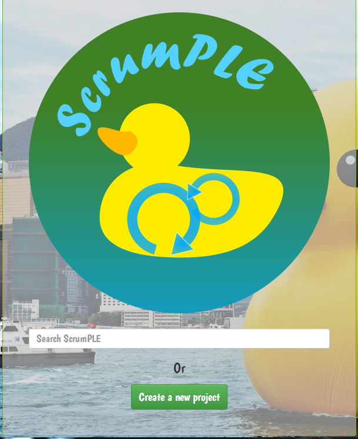
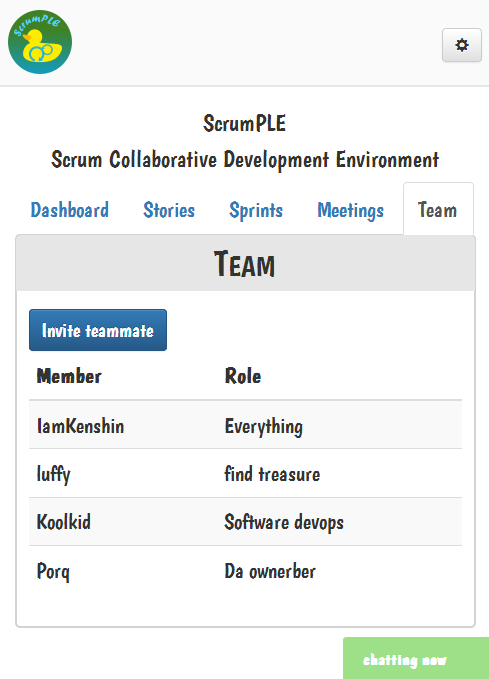
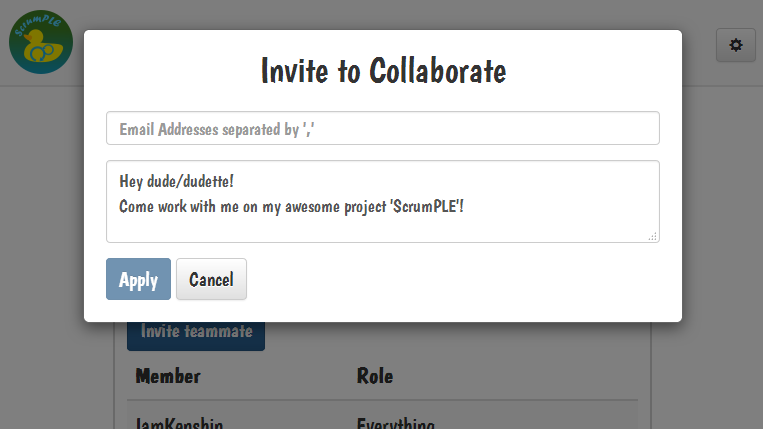
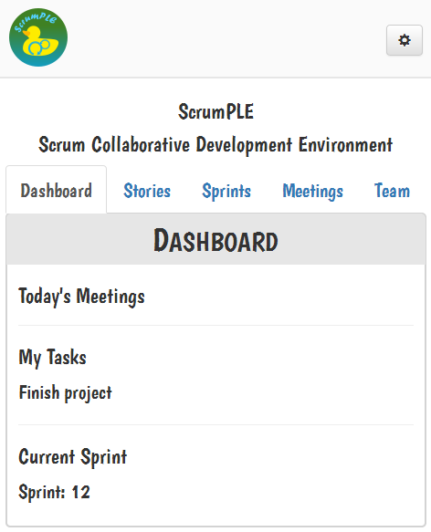
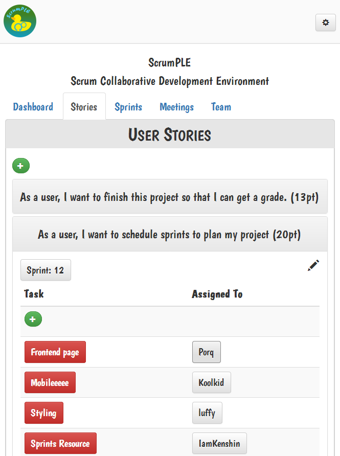
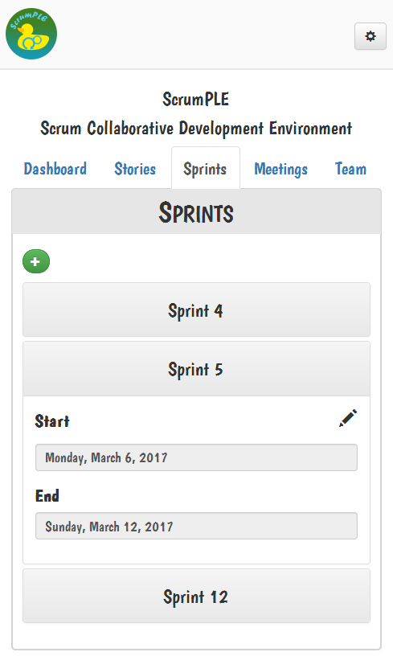
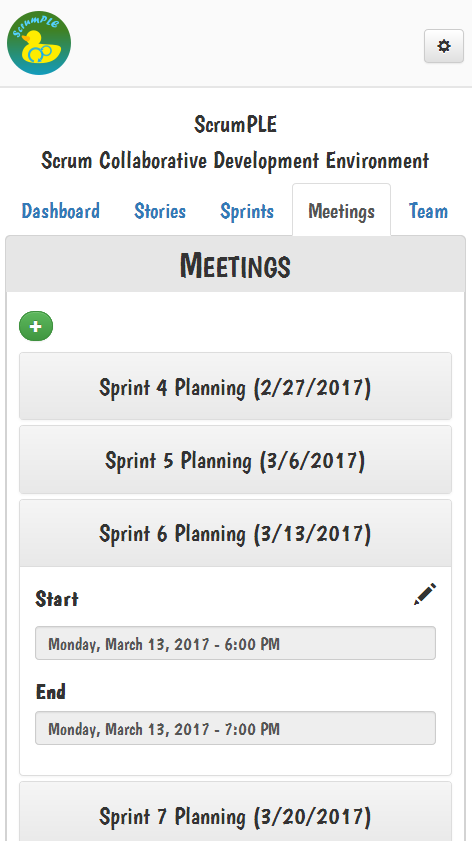

# ScrumPLE
A collaborative development environment tailored to the Scrum framework

## Contents
[Features](#features)  
[Architecture Brief](#architecture-brief)  
[Development](#development)  
[Deployment](#deployment)  
[Screenshots](#screenshots)  
[REST API](#rest-api)  

## Features
ScrumPLE provides a number of useful features and tools intended to promote team collaboration and boost development throughput:
* Isolated project domains for security and tidiness in a multi-tenant SaaS model
* Persistent, tightly-integrated text chat encourages constant collaboration
* Virtual Scrum artifacts provide the **authentic Scrum experience** out of office and in the cloud
* Git repository hosting
* Backlog, user story, and task monitoring

## Architecture Brief
ScrumPLE is composed of 3 fundamental modules:
* SQL database - Any SQL database providing data persistence
* ScrumPLE-Core - A RESTful service providing all business logic
* ScrumPLE-Pretty - An HTML/CSS/JavaScript front-end application providing main access to ScrumPLE

## Development
ScrumPLE development is dependent on several popular development tools:
* [Gradle] for dependency management and project lifecycle

### Building ScrumPLE-Core
Simply run `ScrumPLE-Core/gradlew(.bat)` to generate a WAR file in `ScrumPLE-Core/build/libs/`

## Deployment
The official ScrumPLE deployment is found [here][ScrumPLE] and composed of the following stack:
* [MySQL] database
* [Apache Tomcat] hosting ScrumPLE-Core
* [NGINX] serving ScrumPLE-Pretty

### Additional Configuration
ScrumPLE-Core utilizes several parameters defined in a webapp context file found in `<tomcat-install>/conf/Catalina/localhost/`
* `databaseHost` SQL database address
* `databasePort` SQL database port
* `databaseUser` database access user
* `databasePassword` database access password
* `systemDatabase` main schema name
* `logProps` properties file defining logging preferences

## Screenshots

## REST API
ScrumPLE exposes all business logic via a RESTful web service which can be utilized by any external client.  
Full help can be found [here][ScrumPLE-Core].

[Apache Tomcat]: http://tomcat.apache.org/
[Tomcat]: http://tomcat.apache.org/
[Gradle]: https://gradle.org/
[Jersey]: https://jersey.java.net/
[Node.js]: https://nodejs.org/
[MySQL]: https://www.mysql.com/
[NGINX]: https://www.nginx.com/
[ScrumPLE]: https://scrumple.win/
[ScrumPLE-Core]: https://scrumple.win:8443/scrumple/
